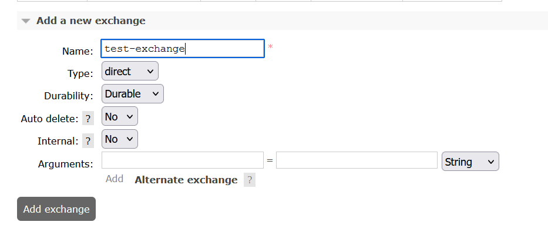
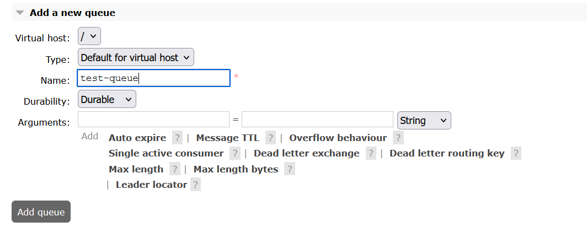
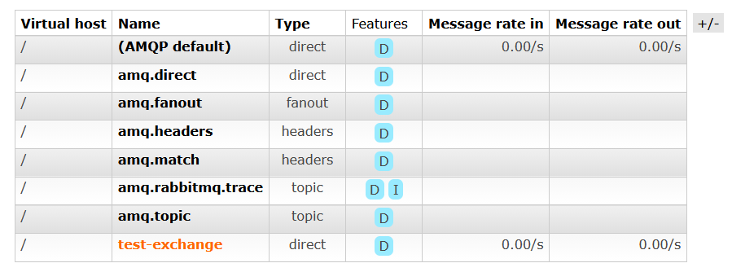
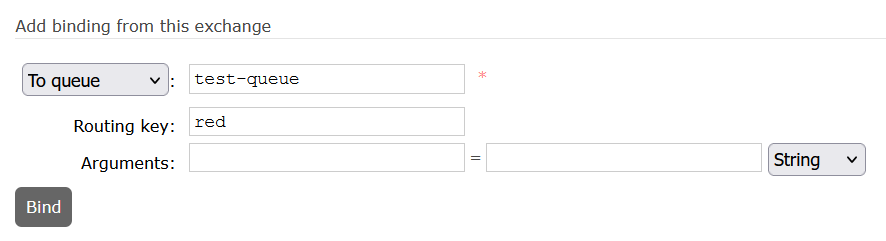
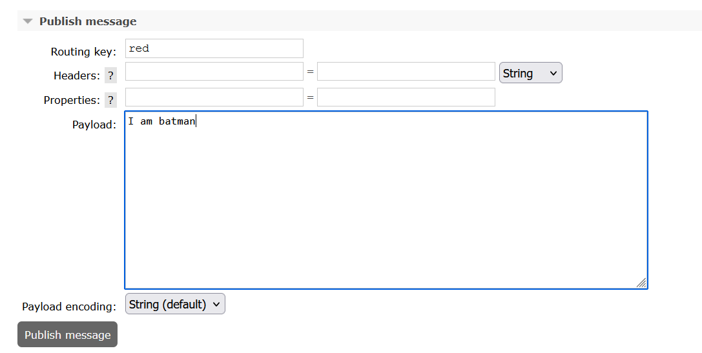
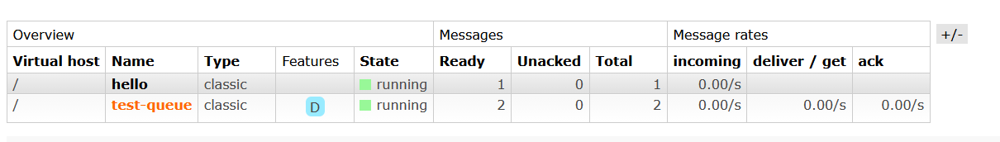
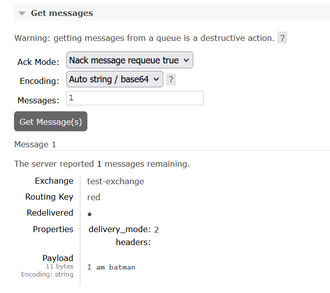

## Setting up the web interface and creating a test queue and exchange

adding an exchange:

adding a queue:

selecting the exchange:

adding a binding:

publishing a message:

selecting the queue:

getting the message:

