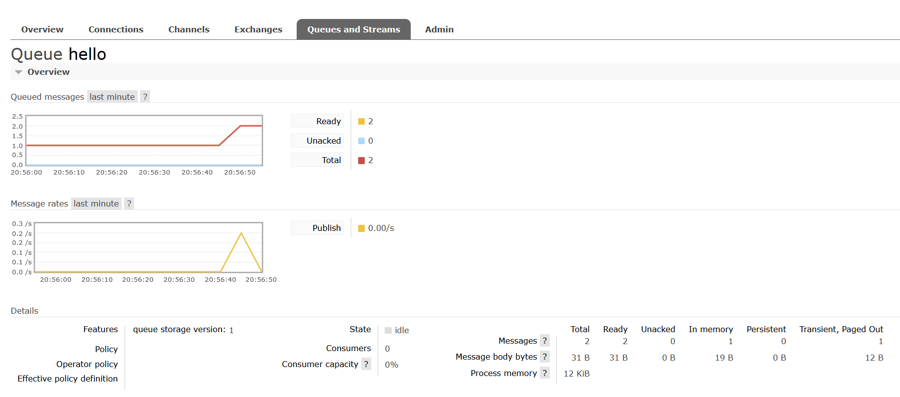
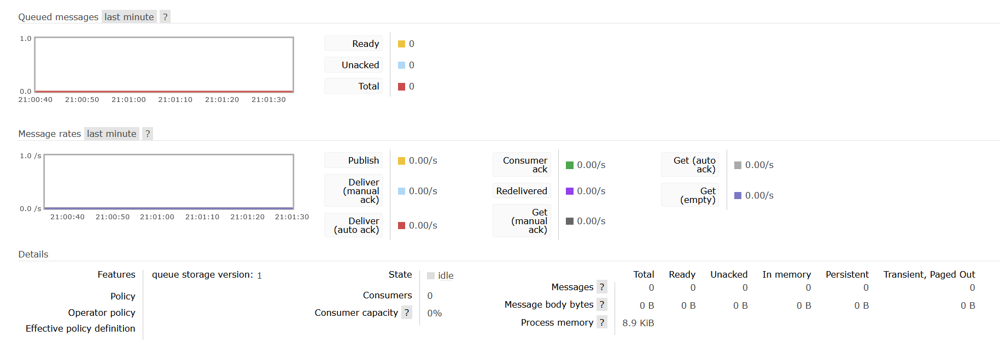
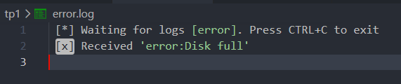
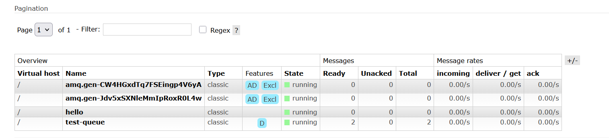

# TP1 Report - Initiation to RabbitMQ for Distributed Applications

## Administrative Information

- Module: Fondement des Systemes repartis
- Lab: TP1 - RabbitMQ
- Student: [Fill in]
- Group: [Fill in]
- Academic Year: [Fill in]
- Submission Date: [Fill in]

## Abstract

This report presents the implementation of TP1 on RabbitMQ, with the same pedagogical objectives as the original sheet and a Docker-based setup instead of local Erlang and RabbitMQ installation. The work covers broker setup, management interface usage, queue and exchange manipulation, producer and consumer development in Java, and direct-exchange routing for selective log processing. The final result is a reproducible lab environment where each question of the original TP is mapped to concrete code and observable behavior.

## 1. Introduction

Message-oriented middleware decouples distributed application components by replacing direct process-to-process communication with asynchronous exchanges through a broker. RabbitMQ is a widely used AMQP broker that supports queues, exchanges, bindings, acknowledgements, and routing policies.

The objective of this TP is to understand these mechanisms through progressive experiments:

1. Start and access a RabbitMQ server.
2. Manipulate entities from the web interface.
3. Implement a producer.
4. Implement a consumer with callback and acknowledgement.
5. Use a direct exchange with routing keys.

## 2. Core Concepts (Concise Definitions)

| Concept         | Practical definition used in this TP                                    |
| --------------- | ----------------------------------------------------------------------- |
| Broker          | RabbitMQ server that receives, stores, and routes messages              |
| Queue           | Buffer where messages wait to be consumed                               |
| Exchange        | Routing component that forwards messages to queues                      |
| Binding         | Rule linking a queue to an exchange (optionally with a key)             |
| Routing key     | String used by exchanges (for example direct exchange) to select queues |
| Producer        | Application that publishes messages                                     |
| Consumer        | Application that receives messages                                      |
| Acknowledgement | Confirmation from consumer that processing is complete                  |

## 3. Environment and Setup Strategy

### 3.1 Requirement in the original TP

The TP sheet requests local installation of Erlang + RabbitMQ on Windows, then enabling the management plugin.

### 3.2 Equivalent setup used in this work

To keep the same learning objectives with better reproducibility, the setup uses Docker Compose:

- Compose file: [compose.yml](compose.yml)
- RabbitMQ image with management plugin already enabled: rabbitmq:3.13-management
- AMQP port: 5672
- Management UI port: 15672
- Default lab credentials: student / student

Main startup command:

    docker compose -f compose.yml up -d

## 4. Project Structure

| File                                                                                 | Role                                                         |
| ------------------------------------------------------------------------------------ | ------------------------------------------------------------ |
| [pom.xml](pom.xml)                                                                   | Java dependencies and execution plugin                       |
| [src/main/java/tp1/RabbitMqConfig.java](src/main/java/tp1/RabbitMqConfig.java)       | ConnectionFactory configuration (host, port, user, password) |
| [src/main/java/tp1/Send.java](src/main/java/tp1/Send.java)                           | Producer for queue hello                                     |
| [src/main/java/tp1/Receive.java](src/main/java/tp1/Receive.java)                     | Consumer with DeliverCallback and explicit ack               |
| [src/main/java/tp1/EmitLogDirect.java](src/main/java/tp1/EmitLogDirect.java)         | Producer to direct exchange direct_logs                      |
| [src/main/java/tp1/ReceiveLogsDirect.java](src/main/java/tp1/ReceiveLogsDirect.java) | Routing-key based consumer for direct exchange               |

## 5. Question-by-Question Mapping (TP Sheet -> Implementation)

### Q1 - Installation

Original request:

- Install Erlang.
- Install RabbitMQ server.

Implemented equivalent:

- Start broker with Docker Compose using [compose.yml](compose.yml).
- No local Erlang or RabbitMQ executable is required.

Validation:

- Container status is healthy.
- Broker listens on 5672 and management UI on 15672.

### Q2 - Enable and use web management interface

Original request:

- Enable rabbitmq_management plugin manually.

Implemented equivalent:

- Management is built into rabbitmq:3.13-management image.
- Access UI at http://localhost:15672.

Validation:

- Successful login with student / student.
- Overview, Exchanges, and Queues tabs are accessible.

### Q3 - Manual queue/exchange/binding operations in UI

Actions performed in UI:

1. Create exchange.
2. Create queue.
3. Bind queue to exchange.
4. Publish a test message.
5. Read the message from the queue.

Captured evidence:

- Exchange creation: 
- Queue creation: 
- Exchange selected: 
- Binding creation: 
- Publish test message: 
- Queue selected: 
- Message retrieval: 

### Q4 - Send client code (hello message)

Implemented in:

- Producer class: [src/main/java/tp1/Send.java](src/main/java/tp1/Send.java)
- Shared connection config: [src/main/java/tp1/RabbitMqConfig.java](src/main/java/tp1/RabbitMqConfig.java)

Command executed:

    mvn -q exec:java '-Dexec.mainClass=tp1.Send' '-Dexec.args=Hello World!'

Expected behavior:

- Queue hello is declared.
- Message is published via default exchange to routing key hello.
- Terminal prints sent confirmation.
- RabbitMQ UI shows queue activity.

Observed evidence:

- UI activity spike: 
- Return to idle after processing interval: 
- Terminal output: [x] Sent 'Hello World!'

### Q5 - Receive client code (consume from queue)

Implemented in:

- Consumer class: [src/main/java/tp1/Receive.java](src/main/java/tp1/Receive.java)

How it maps to TP requirement:

- Uses DeliverCallback to process asynchronous deliveries.
- Starts non-exclusive consumer with basicConsume.
- Uses explicit acknowledgement (autoAck = false with basicAck).

Command executed:

    mvn -q exec:java '-Dexec.mainClass=tp1.Receive'

Observed behavior:

- Consumer waits for incoming messages.
- Messages sent previously are displayed in terminal.

Observed terminal excerpt:

    [*] Waiting for messages. Press CTRL+C to exit
    [x] Received 'healthcheck message'
    [x] Received 'Hello World!'

### Q6 - Exchange and routing with direct exchange

Implemented in:

- Producer to direct exchange: [src/main/java/tp1/EmitLogDirect.java](src/main/java/tp1/EmitLogDirect.java)
- Consumer with dynamic queue and key bindings: [src/main/java/tp1/ReceiveLogsDirect.java](src/main/java/tp1/ReceiveLogsDirect.java)

Experiment setup:

1. Terminal A listens to all severities (info, warning, error).
2. Terminal B listens only to error and writes output to file.
3. Terminal C publishes info, warning, and error messages.

Commands used:

Terminal A:

    mvn -q exec:java '-Dexec.mainClass=tp1.ReceiveLogsDirect'

Terminal B:

    mvn -q exec:java '-Dexec.mainClass=tp1.ReceiveLogsDirect' '-Dexec.args=error' | tee error.log

Terminal C:

    mvn -q exec:java '-Dexec.mainClass=tp1.EmitLogDirect' '-Dexec.args=info App started'
    mvn -q exec:java '-Dexec.mainClass=tp1.EmitLogDirect' '-Dexec.args=warning High memory'
    mvn -q exec:java '-Dexec.mainClass=tp1.EmitLogDirect' '-Dexec.args=error Disk full'

Observed results:

- Terminal A receives all messages.
- Terminal B receives only error.
- error.log file is created with the critical line.
- RabbitMQ creates generated queue names for temporary consumers.

Evidence:

- Error log file present: 
- Generated queue in UI: 

## 6. Results Synthesis

| TP objective                            | Result                                                      |
| --------------------------------------- | ----------------------------------------------------------- |
| Broker installation and accessibility   | Achieved with Docker Compose                                |
| Management interface usage              | Achieved and validated with screenshots                     |
| Producer implementation                 | Achieved with Send.java                                     |
| Consumer with callback and explicit ack | Achieved with Receive.java                                  |
| Direct exchange routing                 | Achieved with EmitLogDirect.java and ReceiveLogsDirect.java |

## 7. Discussion

1. Functional equivalence with the original TP was maintained despite replacing local installation by containerized deployment.
2. The Docker approach improves reproducibility, cleanup, and onboarding speed.
3. The Java code keeps the canonical RabbitMQ tutorial flow while adding explicit acknowledgements in the queue consumer.
4. Routing experiments clearly demonstrate exact-match behavior of direct exchanges.

## 8. Conclusion

The TP objectives were fully achieved. The final project demonstrates the end-to-end RabbitMQ workflow required by the statement: broker setup, web administration, queue operations, producer and consumer coding, and routing with direct exchange. The Docker-based approach preserves the educational content while reducing local setup complexity. The resulting project can be rerun quickly for demonstrations, evaluation, and extension in future labs.

## 9. References

1. TP1 document: MOHAMED YASSINE KALLEL - TP1 RabbitMQ v3.pdf
2. RabbitMQ official documentation: https://www.rabbitmq.com/docs
3. RabbitMQ Java client API: https://rabbitmq.github.io/rabbitmq-java-client/api/current/
